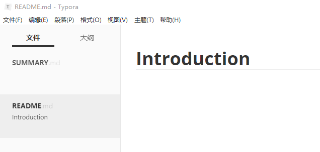
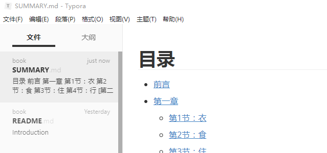
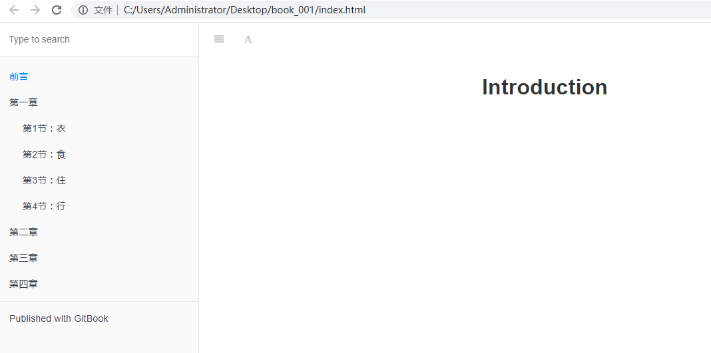

# gitbook使用

​		想象一下，现在你准备构建一本书籍，你在硬盘上新建了一个叫 mybook 的文件夹，按照以前的做法，你会新建一个 Word 文档，写上标题，然后开始巴滋巴滋地笔耕。但是现在有了 GitBook，你首先要做的是在 mybook 文件夹下执行以下命令：

```shell
gitbook init
```

​		执行完后，你会看到多了两个文件 —— README.md 和 SUMMARY.md，它们的作用如下：

> - README.md —— 书籍的介绍写在这个文件里
> - SUMMARY.md —— 书籍的目录结构在这里配置

​		这时候，我们启动恭候多时的 Typora 来编辑这两个文件了：



​		编辑 SUMMARY.md 文件，内容修改为：

```
# 目录

* [前言](README.md)
* [第一章](Chapter1/README.md)
  * [第1节：衣](Chapter1/衣.md)
  * [第2节：食](Chapter1/食.md)
  * [第3节：住](Chapter1/住.md)
  * [第4节：行](Chapter1/行.md)
* [第二章](Chapter2/README.md)
* [第三章](Chapter3/README.md)
* [第四章](Chapter4/README.md)

```

​		然后我们回到命令行，在 mybook 文件夹中再次执行 `gitbook init` 命令。GitBook 会查找 SUMMARY.md 文件中描述的目录和文件，如果没有则会将其创建。

​		Typora 是所见即所得（实时渲染）的 Markdown 编辑器，这时候它是这样的：



​		接着我们执行 `gitbook serve` 来预览这本书籍，执行命令后会对 Markdown 格式的文档进行转换，默认转换为 html 格式，最后提示 “Serving book on http://localhost:4000”。嗯，打开浏览器看一下吧：



​		当你写得差不多，你可以执行 `gitbook build` 命令构建书籍，默认将生成的静态网站输出到 _book 目录。实际上，这一步也包含在 `gitbook serve` 里面，因为它们是 HTML，所以 GitBook 通过 Node.js 给你提供服务了。

​	当然，build 命令可以指定路径：

```shell
gitbook build [书籍路径] [输出路径] 
```

​	serve 命令也可以指定端口：

```shell
gitbook serve --port 2333
```

​	你还可以生成 PDF 格式的电子书：

```shell
gitbook pdf ./ ./mybook.pdf
```

​	生成 epub 格式的电子书：

```shell
gitbook epub ./ ./mybook.epub
```

​	生成 mobi 格式的电子书：

```shell
gitbook mobi ./ ./mybook.mobi
```

​		如果生成不了，你可能还需要安装一些工具，比如 ebook-convert。或者在 Typora 中安装 Pandoc 进行导出。

​		除此之外，别忘了还可以用 Git 做版本管理呀！在 mybook 目录下执行 `git init` 初始化仓库，执行 `git remote add` 添加远程仓库（你得先在远端建好）。接着就可以愉快地 commit，push，pull … 啦！

​		不是程序员的小伙伴可能不太喜欢用命令行，那其实版本管理这部分可以下载安装 Git 或 GitHub 这些客户端程序，在图形界面上操作也是可以完成工作的。反正我觉得挺好的，特别是对我这种懒得排版，又想随时随地写作的宝宝来说。而且能够查看每个版本内容变更的情况，同时又避免了硬盘单一故障带来的风险。
