# 本地上传

首先初始化本地仓库

```shell
git init
```

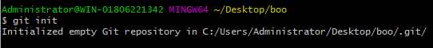


gitbook初始化

```shell
gitbook init
```

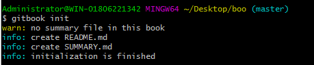


```shell
git remote add origin https://github.com/chaoyuan666/book1.git
```

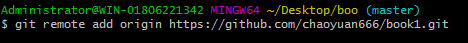

```shell
git add .
```

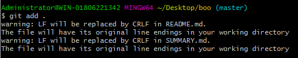

```shell
git commit -m "first up"
```

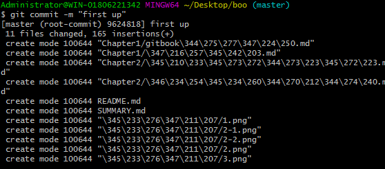


```shell
git push origin master
```

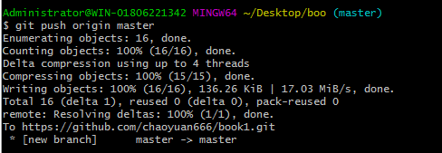


```shell
git checkout -b page
```

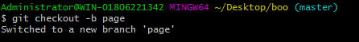


```shell
gitbook serve
```

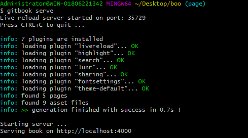


修改文件为_book

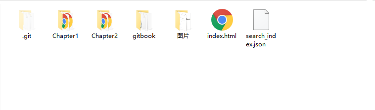


```shell
git push origin page
```


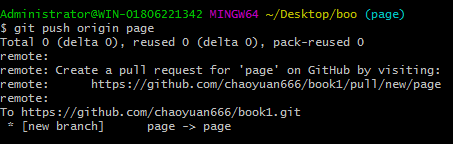


此时，github为两个分支

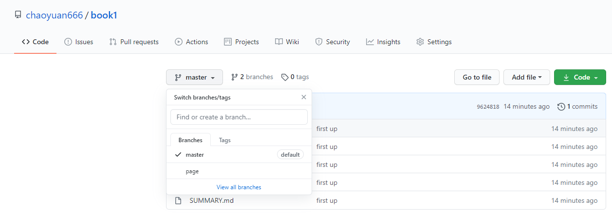


点击settings


设置网页显示

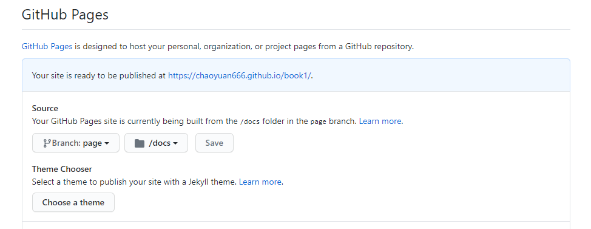

```shell
git add .
```

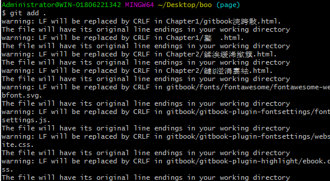


```shell
git commit -m "first up page"
```

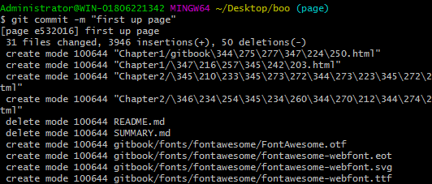